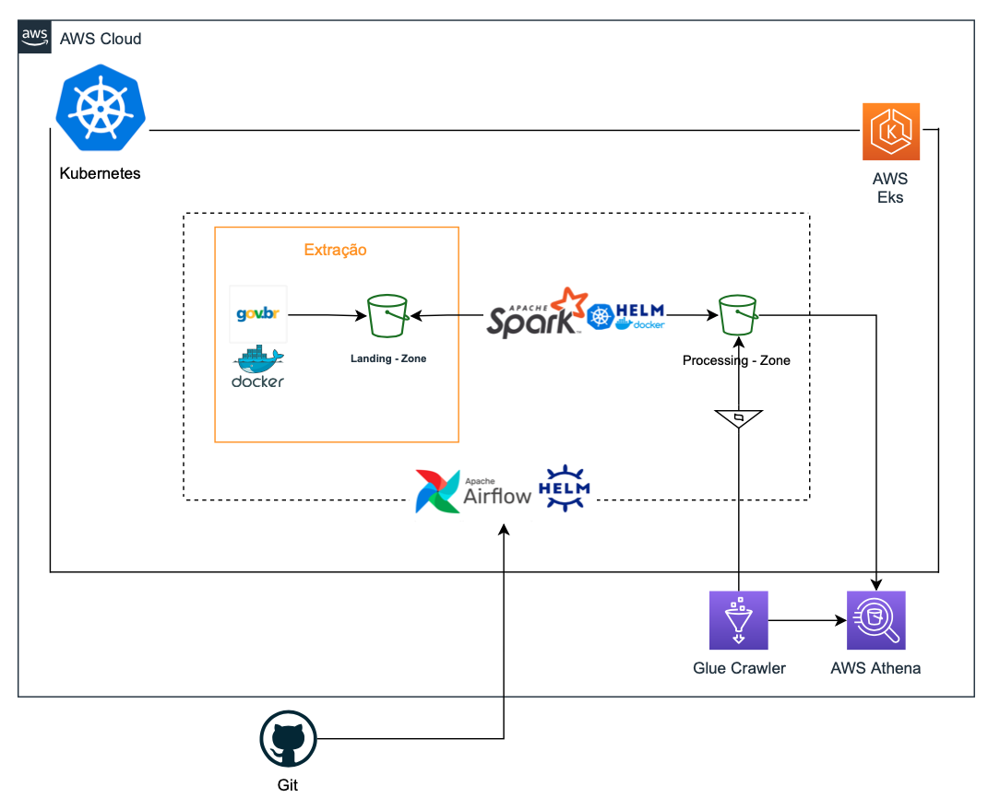
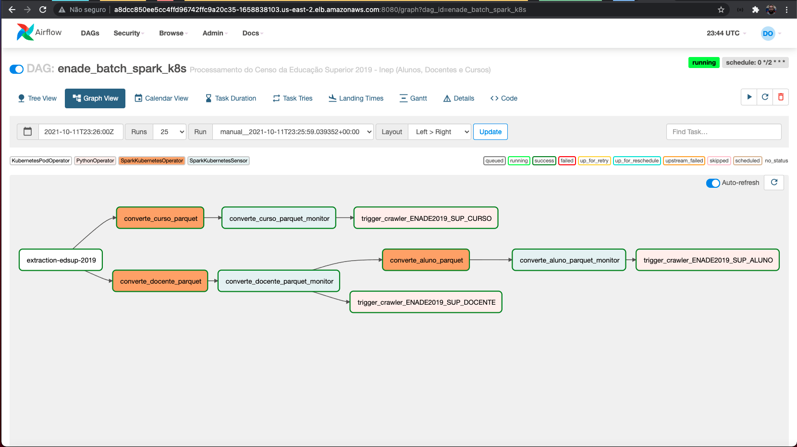

## Desafio Final Bootcamp - IGTI

### Engenheiro de Dados Cloud
#### Professores: Neylson Crepalde, Carlos Barbosa e Pedro Toledo

# Use Case:

Ingestão dos microdados do Censo da Educação Superior 2019 em uma estrutura de Data Lake na AWS. Utilizado o Spark Operator dentro do Kubernetes, onde foi convertido os dados para o formato parquet e escrito os resultados em uma outra camada do Data Lake (processing-zone). Os dados foram disponibilizados para consulta no AWS Athena.

Arquitetura da solução: 

## Dags Airflow

